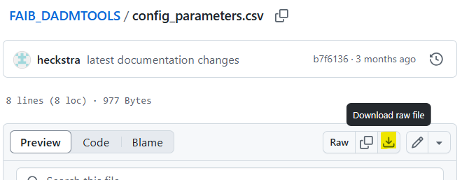

```{r, include = FALSE}
knitr::opts_chunk$set(
  collapse = TRUE,
  comment = "#>"
)
```

```{r setup, message=FALSE, warning=FALSE}
library(dadmtools)
```

# Introduction

This vignette describes a workflow using the functions in the [`dadmtools`](https://github.com/bcgov/FAIB_DADMTOOLS) package. This package supports the workflow of forest and land managment analysis using the Forest Analysis and Inventory Branch (FAIB) process developed for [timber supply review](https://www2.gov.bc.ca/gov/content/industry/forestry/managing-our-forest-resources/timber-supply-review-and-allowable-annual-cut) and [forest landscape planning](https://www2.gov.bc.ca/gov/content/industry/forestry/managing-our-forest-resources/forest-landscape-plans) analysis.

The spatial analysis workflow starts with importing vector and raster data into [PostgreSQL](https://www.postgresql.org/) database tables. Each vector dataset is imported into two tables, one for the spatial data, and one for the attribute data. Each row in the spatial tables represents a 1-hectare cell in the area of interest. The attribute and spatial data are linked using the key `pgid`, and the spatial table is linked to the provincial 1-hectare grid using the key `gr_skey`. 

Landbase netdowns can be defined using `SQL` and result in the analysis forest landbase (AFLB) and timber harvesting land base (THLB). The spatial representaions of other values (e.g. wildlife habitat, visual quality objectives) can be fed into forest estate models along with the AFLB and THLB.

The focus in this vignette is on using the `dadmtools` to get data into the PostgreSQL database for analysis and modelling.

# Overview

After following the example workflow, using a small area with test data (*sandbox*) available [here](.\data), you will have a PostgreSQL relational database ready for analysis and modelling.

Several applications are needed prior to beginning the workflow. The requirements, and instructions for installation, are described on the DADMTOOLS [github](https://github.com/bcgov/FAIB_DADMTOOLS). 

The workflow assumes you have installed the following:

* PostgresQL database version 12 or above
* Oracle Instant Client
* GDAL
* R Version 4 or above
* RStudio

PostgreSQL can be accessed using the command line interface, [pgAdmin](https://www.pgadmin.org/) or [dBeaver](https://dbeaver.io/download/). 

The workflow will start with installing the R packages, adding the libraries, and downloading the test data. A PostgreSQL database is created with the needed schemas and extensions.

A `gr_skey` tiff of the area of interest boundary along with a `gr_skey` PostgreSQL table will be created. These are needed to clip other data layers.

`dadmtools` uses csv configuration files in the process of importing data to PostgreSQL and creating and adding to resultants. These csv files will be downloaded, updated, and used in the example workflow.

The test data will be imported into the PostgreSQL database created, ready for analysis and modelling.

# Workflow

## R Packages

Install the following R packages. 

```{r installPackages, echo=TRUE, eval=FALSE}
install.packages("RPostgres")
install.packages("glue")
install.packages("terra")
install.packages("keyring")
install.packages("sf")
install.packages("devtools")
library(devtools)
install_github("bcgov/FAIB_DADMTOOLS")
```

The libraries will need to be installed again in each new session.

```{r libinstall, echo=TRUE, eval=FALSE}
library(RPostgres)
library(glue)
library(terra)
library(keyring)
library(sf)
library(devtools)
library(devtools)
library(dadmtools)
```

## Downloads

Create a directory for your project. In the following workflow, the directory is named after the *sandbox* area of interest, `sandbox`.

`C:\sandbox`

Download the following csv files into the directory just created. After clicking on the csv name, the github page should open. Use the **Download raw file** to download each csv, and save it to your directory.

```{r out.width = '50%', echo = FALSE}

```

* [config_parameters.csv](https://github.com/bcgov/FAIB_DADMTOOLS/blob/main/config_parameters.csv)

* [create_new_resultant_inputs.csv](https://github.com/bcgov/FAIB_DADMTOOLS/blob/main/create_new_resultant_inputs.csv)

* [batch_add_fields_to_resultant.csv](https://github.com/bcgov/FAIB_DADMTOOLS/blob/main/batch_add_fields_to_resultant.csv)

Download the **sandbox** [data](
S:\FOR\VIC\HTS\ANA\workarea\AR2024\units\training\tsa99) (TODO: download from git). In the example, the test gdb is saved to:

`C:\sandbox\data`

## R Setup

After installing the necessary packages (see Section 4 in the github [README](https://github.com/bcgov/FAIB_DADMTOOLS/blob/main/README.md))

## Database Setup

Ideally, create a **NEW** database in PostgreSQL for each new project. Using the default **postgres** database will work, but project management is helped using individual databases. Benefits include being able to delete one database, should it become corrupted, rather than uninstalling and reinstalling PostgreSQL and vacuuming your active database more quickly, rather than vacumming multiple projects.

In the next step a new database for **sandbox** will be created, called **pgsbx**. `dadmtools` requires two schemas in addition to the default `public` schema: 

* raster
* whse

Along with 3 extentions:

* postgis
* postgis_raster
* oracle_fdw

Below, the database is created, along with the schemas and extensions.

```{r faibDB, echo=TRUE, eval=FALSE}

unit_dbname <- "pgsbx"

con <- RPostgreSQL::dbConnect(dadmtools::get_pg_conn_list())

sql_createdb <- glue('CREATE DATABASE ', unit_dbname)
  
RPostgreSQL::dbSendQuery(con, sql_createdb) 

RPostgreSQL::dbDisconnect(con)

# Connect to db just created
con <- RPostgreSQL::dbConnect(dadmtools::get_pg_conn_list(dbname=unit_dbname))

RPostgreSQL::dbSendQuery(con, "CREATE EXTENSION postgis;")

RPostgreSQL::dbSendQuery(con, "CREATE EXTENSION postgis_raster;")

RPostgreSQL::dbSendQuery(con, "CREATE EXTENSION oracle_fdw;")

RPostgreSQL::dbSendQuery(con, "CREATE SCHEMA raster;")

RPostgreSQL::dbSendQuery(con, "CREATE SCHEMA whse;")

RPostgreSQL::dbDisconnect(con)

```

## Keyring

The dadmtools library uses the Windows Credential Manager Keyring to manage passwords. The following workflow requires 2 keyrings: **localsql** and **oracle**. **localsql** has the accesses credentials for the database **pgsbx** created above, and **oracle** has the access credentials for the BC Geographic Warehouse ([BCGW](https://www2.gov.bc.ca/gov/content/data/finding-and-sharing/bc-geographic-warehouse#about)). The two keyrings are created below. 


